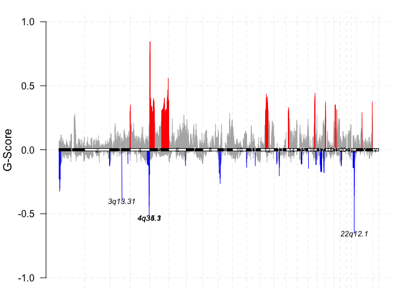

<!-- README.md is generated from README.Rmd. Please edit that file -->

# TCGAgistic

<!-- badges: start -->

[](https://lifecycle.r-lib.org/articles/stages.html#experimental)
[](https://CRAN.R-project.org/package=TCGAgistic)
[](https://github.com/CCICB/TCGAgistic/actions/workflows/R-CMD-check.yaml)
[](https://CCICB.r-universe.dev/ui#package:TCGAgistic)
[](https://doi.org/10.5281/zenodo.8115633)
<!-- badges: end -->

The goal of TCGAgistic is to easily load gistic copy-number analysis for
TCGA cohorts into R

## Installation

Install TCGAgistic from R universe:

``` r
# Install TCGAgistic from R:
install.packages('TCGAgistic', repos = c('https://ccicb.r-universe.dev', 'https://cloud.r-project.org'))
```

Alternatively, you can install the development version from github:

``` r
# install.packages("remotes")
remotes::install_github('CCICB/TCGAgistic')
```

## Quick Start

### Visualising TCGA copy number alterations

Load the GISTIC dataset and visualise results

``` r
library(TCGAgistic)
library(maftools)

# Load dataset
gistic <- tcga_gistic_load("ACC", source = "Firehose", cnLevel = "all")

# Visualise results
gisticChromPlot(gistic)
```



### List all available datasets

``` r
library(TCGAgistic)

# Check available datasets
tcga_gistic_available()
#>       Cohort                                        FullName   Source
#> 1        ACC                        Adrenocortical carcinoma Firehose
#> 2        ACC                        Adrenocortical carcinoma Firehose
#> 3        ACC                        Adrenocortical carcinoma Firehose
#> 4       BLCA                    Bladder urothelial carcinoma Firehose
#> 5       BLCA                    Bladder urothelial carcinoma Firehose
#> 6       BLCA                    Bladder urothelial carcinoma Firehose
#> 7       BRCA                       Breast invasive carcinoma Firehose
#> 8       BRCA                       Breast invasive carcinoma Firehose
#> 9       BRCA                       Breast invasive carcinoma Firehose
#> 10      CESC               Cervical and endocervical cancers Firehose
#> 11      CESC               Cervical and endocervical cancers Firehose
#> 12      CESC               Cervical and endocervical cancers Firehose
#> 13      CHOL                              Cholangiocarcinoma Firehose
#> 14      CHOL                              Cholangiocarcinoma Firehose
#> 15      CHOL                              Cholangiocarcinoma Firehose
#> 16      COAD                            Colon adenocarcinoma Firehose
#> 17      COAD                            Colon adenocarcinoma Firehose
#> 18      COAD                            Colon adenocarcinoma Firehose
#> 19  COADREAD                       Colorectal adenocarcinoma Firehose
#> 20  COADREAD                       Colorectal adenocarcinoma Firehose
#> 21  COADREAD                       Colorectal adenocarcinoma Firehose
#> 22      DLBC Lymphoid Neoplasm Diffuse Large B-cell Lymphoma Firehose
#> 23      DLBC Lymphoid Neoplasm Diffuse Large B-cell Lymphoma Firehose
#> 24      DLBC Lymphoid Neoplasm Diffuse Large B-cell Lymphoma Firehose
#> 25      ESCA                            Esophageal carcinoma Firehose
#> 26      ESCA                            Esophageal carcinoma Firehose
#> 27      ESCA                            Esophageal carcinoma Firehose
#> 28       GBM                         Glioblastoma multiforme Firehose
#> 29       GBM                         Glioblastoma multiforme Firehose
#> 30       GBM                         Glioblastoma multiforme Firehose
#> 31    GBMLGG                                          Glioma Firehose
#> 32    GBMLGG                                          Glioma Firehose
#> 33    GBMLGG                                          Glioma Firehose
#> 34      HNSC           Head and Neck squamous cell carcinoma Firehose
#> 35      HNSC           Head and Neck squamous cell carcinoma Firehose
#> 36      HNSC           Head and Neck squamous cell carcinoma Firehose
#> 37      KICH                              Kidney Chromophobe Firehose
#> 38      KICH                              Kidney Chromophobe Firehose
#> 39      KICH                              Kidney Chromophobe Firehose
#> 40     KIPAN              Pan-kidney cohort (KICH+KIRC+KIRP) Firehose
#> 41     KIPAN              Pan-kidney cohort (KICH+KIRC+KIRP) Firehose
#> 42     KIPAN              Pan-kidney cohort (KICH+KIRC+KIRP) Firehose
#> 43      KIRC               Kidney renal clear cell carcinoma Firehose
#> 44      KIRC               Kidney renal clear cell carcinoma Firehose
#> 45      KIRC               Kidney renal clear cell carcinoma Firehose
#> 46      KIRP           Kidney renal papillary cell carcinoma Firehose
#> 47      KIRP           Kidney renal papillary cell carcinoma Firehose
#> 48      KIRP           Kidney renal papillary cell carcinoma Firehose
#> 49      LAML                          Acute Myeloid Leukemia Firehose
#> 50      LAML                          Acute Myeloid Leukemia Firehose
#> 51      LAML                          Acute Myeloid Leukemia Firehose
#> 52       LGG                        Brain Lower Grade Glioma Firehose
#> 53       LGG                        Brain Lower Grade Glioma Firehose
#> 54       LGG                        Brain Lower Grade Glioma Firehose
#> 55      LIHC                  Liver hepatocellular carcinoma Firehose
#> 56      LIHC                  Liver hepatocellular carcinoma Firehose
#> 57      LIHC                  Liver hepatocellular carcinoma Firehose
#> 58      LUAD                             Lung adenocarcinoma Firehose
#> 59      LUAD                             Lung adenocarcinoma Firehose
#> 60      LUAD                             Lung adenocarcinoma Firehose
#> 61      LUSC                    Lung squamous cell carcinoma Firehose
#> 62      LUSC                    Lung squamous cell carcinoma Firehose
#> 63      LUSC                    Lung squamous cell carcinoma Firehose
#> 64      MESO                                    Mesothelioma Firehose
#> 65      MESO                                    Mesothelioma Firehose
#> 66        OV               Ovarian serous cystadenocarcinoma Firehose
#> 67        OV               Ovarian serous cystadenocarcinoma Firehose
#> 68        OV               Ovarian serous cystadenocarcinoma Firehose
#> 69      PAAD                       Pancreatic adenocarcinoma Firehose
#> 70      PAAD                       Pancreatic adenocarcinoma Firehose
#> 71      PAAD                       Pancreatic adenocarcinoma Firehose
#> 72      PCPG              Pheochromocytoma and Paraganglioma Firehose
#> 73      PCPG              Pheochromocytoma and Paraganglioma Firehose
#> 74      PCPG              Pheochromocytoma and Paraganglioma Firehose
#> 75      PRAD                         Prostate adenocarcinoma Firehose
#> 76      PRAD                         Prostate adenocarcinoma Firehose
#> 77      PRAD                         Prostate adenocarcinoma Firehose
#> 78      READ                           Rectum adenocarcinoma Firehose
#> 79      READ                           Rectum adenocarcinoma Firehose
#> 80      READ                           Rectum adenocarcinoma Firehose
#> 81      SARC                                         Sarcoma Firehose
#> 82      SARC                                         Sarcoma Firehose
#> 83      SARC                                         Sarcoma Firehose
#> 84      SKCM                         Skin Cutaneous Melanoma Firehose
#> 85      SKCM                         Skin Cutaneous Melanoma Firehose
#> 86      SKCM                         Skin Cutaneous Melanoma Firehose
#> 87      STAD                          Stomach adenocarcinoma Firehose
#> 88      STAD                          Stomach adenocarcinoma Firehose
#> 89      STAD                          Stomach adenocarcinoma Firehose
#> 90      STES                Stomach and Esophageal carcinoma Firehose
#> 91      STES                Stomach and Esophageal carcinoma Firehose
#> 92      STES                Stomach and Esophageal carcinoma Firehose
#> 93      TGCT                     Testicular Germ Cell Tumors Firehose
#> 94      TGCT                     Testicular Germ Cell Tumors Firehose
#> 95      TGCT                     Testicular Germ Cell Tumors Firehose
#> 96      THCA                               Thyroid carcinoma Firehose
#> 97      THCA                               Thyroid carcinoma Firehose
#> 98      THCA                               Thyroid carcinoma Firehose
#> 99      THYM                                         Thymoma Firehose
#> 100     THYM                                         Thymoma Firehose
#> 101     THYM                                         Thymoma Firehose
#> 102     UCEC            Uterine Corpus Endometrial Carcinoma Firehose
#> 103     UCEC            Uterine Corpus Endometrial Carcinoma Firehose
#> 104     UCEC            Uterine Corpus Endometrial Carcinoma Firehose
#> 105      UCS                          Uterine Carcinosarcoma Firehose
#> 106      UCS                          Uterine Carcinosarcoma Firehose
#> 107      UCS                          Uterine Carcinosarcoma Firehose
#> 108      UVM                                  Uveal Melanoma Firehose
#> 109      UVM                                  Uveal Melanoma Firehose
#> 110      UVM                                  Uveal Melanoma Firehose
#>     CopyNumberLevel                              Filepath              DOI
#> 1               all          ACC_Firehose.cnlevel_all.rds 10.7908/C1CN7372
#> 2              deep         ACC_Firehose.cnlevel_deep.rds 10.7908/C1CN7372
#> 3           shallow      ACC_Firehose.cnlevel_shallow.rds 10.7908/C1CN7372
#> 4               all         BLCA_Firehose.cnlevel_all.rds 10.7908/C16T0KXB
#> 5              deep        BLCA_Firehose.cnlevel_deep.rds 10.7908/C16T0KXB
#> 6           shallow     BLCA_Firehose.cnlevel_shallow.rds 10.7908/C16T0KXB
#> 7               all         BRCA_Firehose.cnlevel_all.rds 10.7908/C1NP23RQ
#> 8              deep        BRCA_Firehose.cnlevel_deep.rds 10.7908/C1NP23RQ
#> 9           shallow     BRCA_Firehose.cnlevel_shallow.rds 10.7908/C1NP23RQ
#> 10              all         CESC_Firehose.cnlevel_all.rds 10.7908/C16D5SCD
#> 11             deep        CESC_Firehose.cnlevel_deep.rds 10.7908/C16D5SCD
#> 12          shallow     CESC_Firehose.cnlevel_shallow.rds 10.7908/C16D5SCD
#> 13              all         CHOL_Firehose.cnlevel_all.rds 10.7908/C1S181WN
#> 14             deep        CHOL_Firehose.cnlevel_deep.rds 10.7908/C1S181WN
#> 15          shallow     CHOL_Firehose.cnlevel_shallow.rds 10.7908/C1S181WN
#> 16              all         COAD_Firehose.cnlevel_all.rds 10.7908/C1M61JMS
#> 17             deep        COAD_Firehose.cnlevel_deep.rds 10.7908/C1M61JMS
#> 18          shallow     COAD_Firehose.cnlevel_shallow.rds 10.7908/C1M61JMS
#> 19              all     COADREAD_Firehose.cnlevel_all.rds 10.7908/C1SJ1JZ8
#> 20             deep    COADREAD_Firehose.cnlevel_deep.rds 10.7908/C1SJ1JZ8
#> 21          shallow COADREAD_Firehose.cnlevel_shallow.rds 10.7908/C1SJ1JZ8
#> 22              all         DLBC_Firehose.cnlevel_all.rds 10.7908/C13R0S77
#> 23             deep        DLBC_Firehose.cnlevel_deep.rds 10.7908/C13R0S77
#> 24          shallow     DLBC_Firehose.cnlevel_shallow.rds 10.7908/C13R0S77
#> 25              all         ESCA_Firehose.cnlevel_all.rds 10.7908/C1XS5TQM
#> 26             deep        ESCA_Firehose.cnlevel_deep.rds 10.7908/C1XS5TQM
#> 27          shallow     ESCA_Firehose.cnlevel_shallow.rds 10.7908/C1XS5TQM
#> 28              all          GBM_Firehose.cnlevel_all.rds 10.7908/C1HD7V19
#> 29             deep         GBM_Firehose.cnlevel_deep.rds 10.7908/C1HD7V19
#> 30          shallow      GBM_Firehose.cnlevel_shallow.rds 10.7908/C1HD7V19
#> 31              all       GBMLGG_Firehose.cnlevel_all.rds 10.7908/C1K35T1N
#> 32             deep      GBMLGG_Firehose.cnlevel_deep.rds 10.7908/C1K35T1N
#> 33          shallow   GBMLGG_Firehose.cnlevel_shallow.rds 10.7908/C1K35T1N
#> 34              all         HNSC_Firehose.cnlevel_all.rds 10.7908/C1V987FP
#> 35             deep        HNSC_Firehose.cnlevel_deep.rds 10.7908/C1V987FP
#> 36          shallow     HNSC_Firehose.cnlevel_shallow.rds 10.7908/C1V987FP
#> 37              all         KICH_Firehose.cnlevel_all.rds 10.7908/C1DZ07QR
#> 38             deep        KICH_Firehose.cnlevel_deep.rds 10.7908/C1DZ07QR
#> 39          shallow     KICH_Firehose.cnlevel_shallow.rds 10.7908/C1DZ07QR
#> 40              all        KIPAN_Firehose.cnlevel_all.rds 10.7908/C1CR5SSS
#> 41             deep       KIPAN_Firehose.cnlevel_deep.rds 10.7908/C1CR5SSS
#> 42          shallow    KIPAN_Firehose.cnlevel_shallow.rds 10.7908/C1CR5SSS
#> 43              all         KIRC_Firehose.cnlevel_all.rds 10.7908/C1FF3RRP
#> 44             deep        KIRC_Firehose.cnlevel_deep.rds 10.7908/C1FF3RRP
#> 45          shallow     KIRC_Firehose.cnlevel_shallow.rds 10.7908/C1FF3RRP
#> 46              all         KIRP_Firehose.cnlevel_all.rds 10.7908/C1H41QVC
#> 47             deep        KIRP_Firehose.cnlevel_deep.rds 10.7908/C1H41QVC
#> 48          shallow     KIRP_Firehose.cnlevel_shallow.rds 10.7908/C1H41QVC
#> 49              all         LAML_Firehose.cnlevel_all.rds 10.7908/C16H4GT5
#> 50             deep        LAML_Firehose.cnlevel_deep.rds 10.7908/C16H4GT5
#> 51          shallow     LAML_Firehose.cnlevel_shallow.rds 10.7908/C16H4GT5
#> 52              all          LGG_Firehose.cnlevel_all.rds 10.7908/C12J6B7R
#> 53             deep         LGG_Firehose.cnlevel_deep.rds 10.7908/C12J6B7R
#> 54          shallow      LGG_Firehose.cnlevel_shallow.rds 10.7908/C12J6B7R
#> 55              all         LIHC_Firehose.cnlevel_all.rds 10.7908/C1474990
#> 56             deep        LIHC_Firehose.cnlevel_deep.rds 10.7908/C1474990
#> 57          shallow     LIHC_Firehose.cnlevel_shallow.rds 10.7908/C1474990
#> 58              all         LUAD_Firehose.cnlevel_all.rds 10.7908/C1348JSB
#> 59             deep        LUAD_Firehose.cnlevel_deep.rds 10.7908/C1348JSB
#> 60          shallow     LUAD_Firehose.cnlevel_shallow.rds 10.7908/C1348JSB
#> 61              all         LUSC_Firehose.cnlevel_all.rds 10.7908/C1RJ4HX7
#> 62             deep        LUSC_Firehose.cnlevel_deep.rds 10.7908/C1RJ4HX7
#> 63          shallow     LUSC_Firehose.cnlevel_shallow.rds 10.7908/C1RJ4HX7
#> 64              all         MESO_Firehose.cnlevel_all.rds 10.7908/C1DZ07R6
#> 65          shallow     MESO_Firehose.cnlevel_shallow.rds 10.7908/C1DZ07R6
#> 66              all           OV_Firehose.cnlevel_all.rds 10.7908/C1P84B9Q
#> 67             deep          OV_Firehose.cnlevel_deep.rds 10.7908/C1P84B9Q
#> 68          shallow       OV_Firehose.cnlevel_shallow.rds 10.7908/C1P84B9Q
#> 69              all         PAAD_Firehose.cnlevel_all.rds 10.7908/C1BP0271
#> 70             deep        PAAD_Firehose.cnlevel_deep.rds 10.7908/C1BP0271
#> 71          shallow     PAAD_Firehose.cnlevel_shallow.rds 10.7908/C1BP0271
#> 72              all         PCPG_Firehose.cnlevel_all.rds 10.7908/C19K49PX
#> 73             deep        PCPG_Firehose.cnlevel_deep.rds 10.7908/C19K49PX
#> 74          shallow     PCPG_Firehose.cnlevel_shallow.rds 10.7908/C19K49PX
#> 75              all         PRAD_Firehose.cnlevel_all.rds 10.7908/C14Q7TFZ
#> 76             deep        PRAD_Firehose.cnlevel_deep.rds 10.7908/C14Q7TFZ
#> 77          shallow     PRAD_Firehose.cnlevel_shallow.rds 10.7908/C14Q7TFZ
#> 78              all         READ_Firehose.cnlevel_all.rds 10.7908/C1ZS2VZB
#> 79             deep        READ_Firehose.cnlevel_deep.rds 10.7908/C1ZS2VZB
#> 80          shallow     READ_Firehose.cnlevel_shallow.rds 10.7908/C1ZS2VZB
#> 81              all         SARC_Firehose.cnlevel_all.rds 10.7908/C190238F
#> 82             deep        SARC_Firehose.cnlevel_deep.rds 10.7908/C190238F
#> 83          shallow     SARC_Firehose.cnlevel_shallow.rds 10.7908/C190238F
#> 84              all         SKCM_Firehose.cnlevel_all.rds 10.7908/C1445KXQ
#> 85             deep        SKCM_Firehose.cnlevel_deep.rds 10.7908/C1445KXQ
#> 86          shallow     SKCM_Firehose.cnlevel_shallow.rds 10.7908/C1445KXQ
#> 87              all         STAD_Firehose.cnlevel_all.rds 10.7908/C1K073R3
#> 88             deep        STAD_Firehose.cnlevel_deep.rds 10.7908/C1K073R3
#> 89          shallow     STAD_Firehose.cnlevel_shallow.rds 10.7908/C1K073R3
#> 90              all         STES_Firehose.cnlevel_all.rds 10.7908/C1D50MFS
#> 91             deep        STES_Firehose.cnlevel_deep.rds 10.7908/C1D50MFS
#> 92          shallow     STES_Firehose.cnlevel_shallow.rds 10.7908/C1D50MFS
#> 93              all         TGCT_Firehose.cnlevel_all.rds 10.7908/C1ZS2W06
#> 94             deep        TGCT_Firehose.cnlevel_deep.rds 10.7908/C1ZS2W06
#> 95          shallow     TGCT_Firehose.cnlevel_shallow.rds 10.7908/C1ZS2W06
#> 96              all         THCA_Firehose.cnlevel_all.rds 10.7908/C1SX6CQR
#> 97             deep        THCA_Firehose.cnlevel_deep.rds 10.7908/C1SX6CQR
#> 98          shallow     THCA_Firehose.cnlevel_shallow.rds 10.7908/C1SX6CQR
#> 99              all         THYM_Firehose.cnlevel_all.rds 10.7908/C1CJ8D00
#> 100            deep        THYM_Firehose.cnlevel_deep.rds 10.7908/C1CJ8D00
#> 101         shallow     THYM_Firehose.cnlevel_shallow.rds 10.7908/C1CJ8D00
#> 102             all         UCEC_Firehose.cnlevel_all.rds 10.7908/C16M36B7
#> 103            deep        UCEC_Firehose.cnlevel_deep.rds 10.7908/C16M36B7
#> 104         shallow     UCEC_Firehose.cnlevel_shallow.rds 10.7908/C16M36B7
#> 105             all          UCS_Firehose.cnlevel_all.rds 10.7908/C1W37VTX
#> 106            deep         UCS_Firehose.cnlevel_deep.rds 10.7908/C1W37VTX
#> 107         shallow      UCS_Firehose.cnlevel_shallow.rds 10.7908/C1W37VTX
#> 108             all          UVM_Firehose.cnlevel_all.rds 10.7908/C1TX3DWK
#> 109            deep         UVM_Firehose.cnlevel_deep.rds 10.7908/C1TX3DWK
#> 110         shallow      UVM_Firehose.cnlevel_shallow.rds 10.7908/C1TX3DWK
```

## How it works

TCGAgistic streams `rds` files from github, located in the
[TCGAgisticDB](https://github.com/CCICB/TCGAgisticDB) package, into your
local R session
